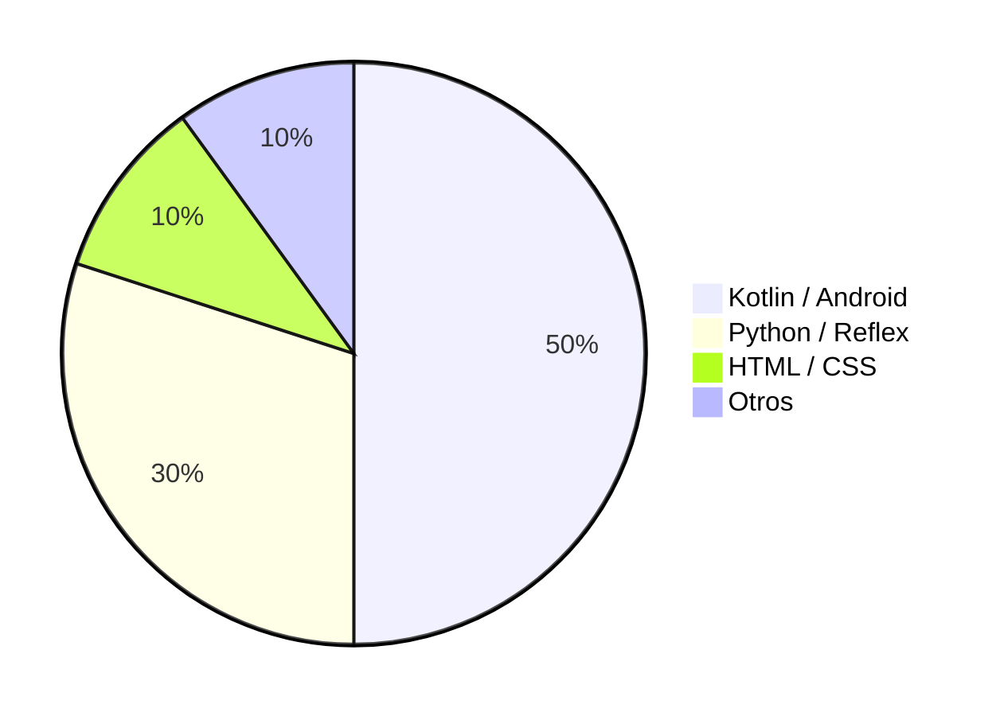

# 🚀 Gabriel Visiedo — Full Stack Developer

  
  
  
  
  
  
  

  
  

---

Bienvenido a mi perfil. Soy un desarrollador autodidacta apasionado por crear **apps Android con Kotlin** y **aplicaciones web con Python/Reflex**. Empecé a programar durante la pandemia y desde entonces no he parado de aprender y construir.

## 🎯 Sobre Mí

- 📱 **Apps Móviles**: Jetpack Compose, Kotlin, Play Store
- 🌐 **Desarrollo Web**: Python, Reflex, HTML/CSS
- 🗄️ **Backend & DB**: Supabase, Firebase, PostgreSQL
- 🛠️ **DevOps**: Docker, Railway, GitHub Actions
- 📚 **Formación**: Udemy, Coursera, Fundae (Python, automatización, IA)

## 🌟 Proyectos Destacados

### 🏨 Hotel Mena Plaza — Sistema Integral de Gestión Hotelera

Dashboard web en tiempo real + apps Android interconectadas con Supabase. Control de recepción, tareas, personal y estado de habitaciones.

### 🍽️ Mena Garden — App GastroBar

App Android para GastroBar en Nerja con menú digital y reservas.

### 🏖️ Nerja Guide Experience — Guía Turística

Guía turística interactiva de Nerja con puntos de interés, playas y rutas.

### 🏡 Vistamar Apartments — Web Booking

Web para apartamentos turísticos con sistema de reservas integrado.

### 🎉 Mena Cumples — Plataforma de Eventos

Plataforma web para gestión de eventos y celebraciones.

### 📋 MenaTask — Suite de Gestión Hotelera Interna
Apps Android (MenaTask, MenaTask Staff, MenaTask TPV) para gestión de personal, tareas de mantenimiento y punto de venta.

## 📊 Proyectos por Tecnología

## 🔗 Conéctate Conmigo

  
  
  

---

⭐ Desde 2020, convirtiendo código en soluciones reales.

